这个项目基于`react + antdesign + react-router + redux + axios + mock + AMap + echarts`等技术栈完成。初学react的小学渣，如果有哪些地方写的有问题，希望可以多多指点，也欢迎大家能多多`star`一下，支持一下，花费业余时间开发不容易，联系方式`15201512159@163.com`，谢谢！！！

## 项目介绍

注意：现在项目并没有全部完成，部分功能待开发

项目运行

```javascript
git clone https://github.com/chengllNice/react-store-admin.git

cd react-store-admin

cnpm i

npm start

```


### 首先进入登录界面

`默认可以登录的账号`

说明：现在账号没有分权限，进入看到的内容都是一样的，以后可能会加上权限的限制

账号：root，密码：123456

账号：bussiness，密码：123456

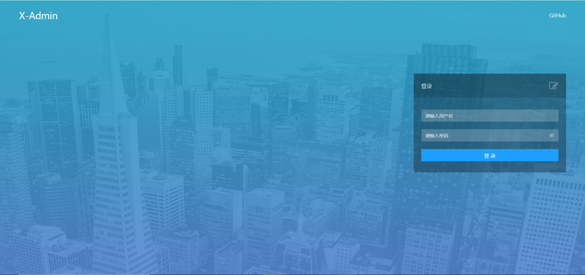

### 登录之后进入首页

右上角可以进入主题皮肤的切换，现在支持4中皮肤

当前页展示所有店铺位置信息,可以点击查看每个店铺的基本信息和进入详情页。支持按店铺名称搜索

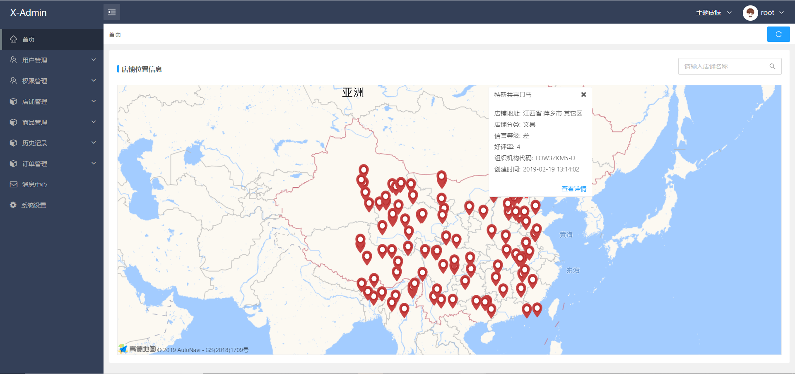

### 用户管理--商家用户列表

支持按照用户角色，创建时间，用户名，邮箱，手机号进行筛选

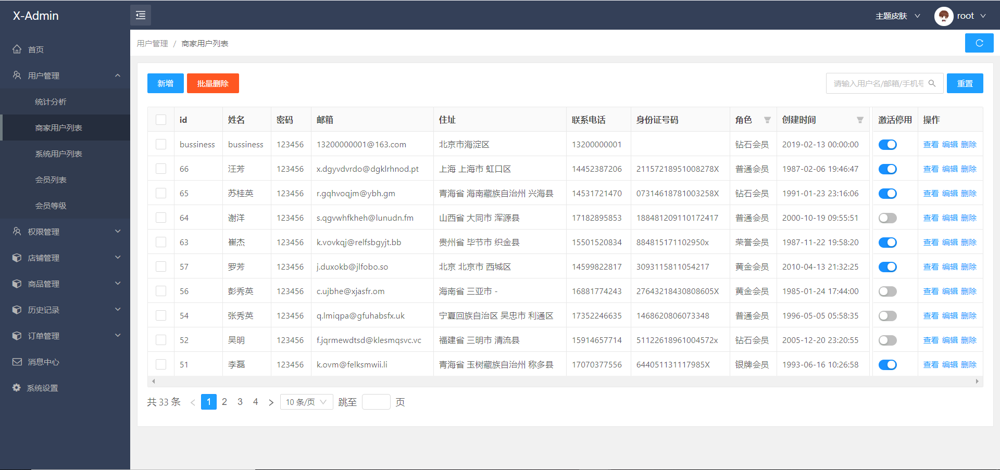

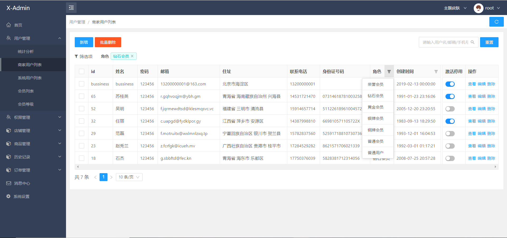

### 用户管理--商家用户列表--新增

表单验证是由自己独自写的，可能有地方写的有问题，如果发现问题，希望可以联系我(联系方式见上边)！！

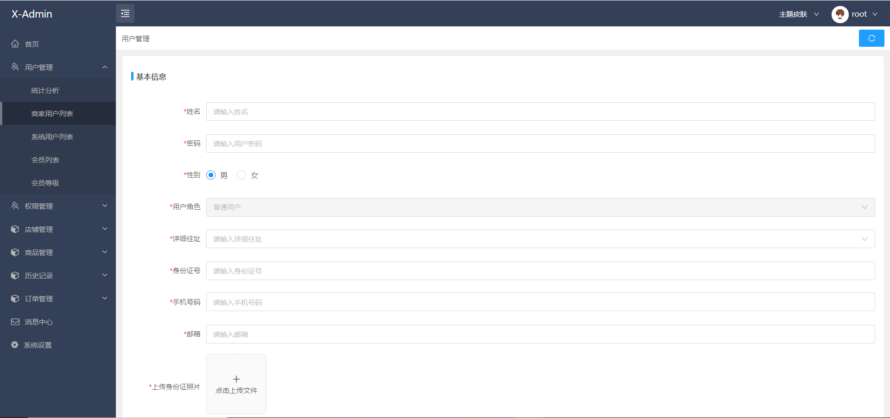

### 用户管理--商家用户列表--详情

由于头像是在线的图片，可能会加载失败

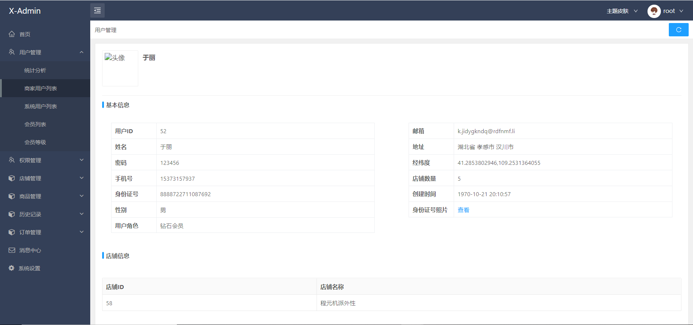

### 用户管理--系统用户列表

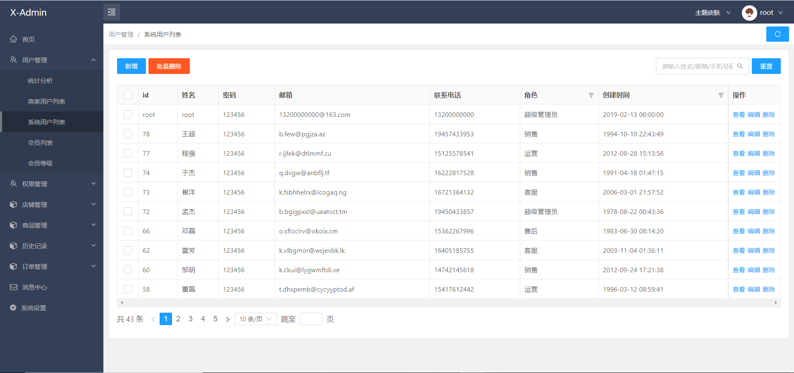

### 权限管理--角色列表


### 店铺管理--统计分析

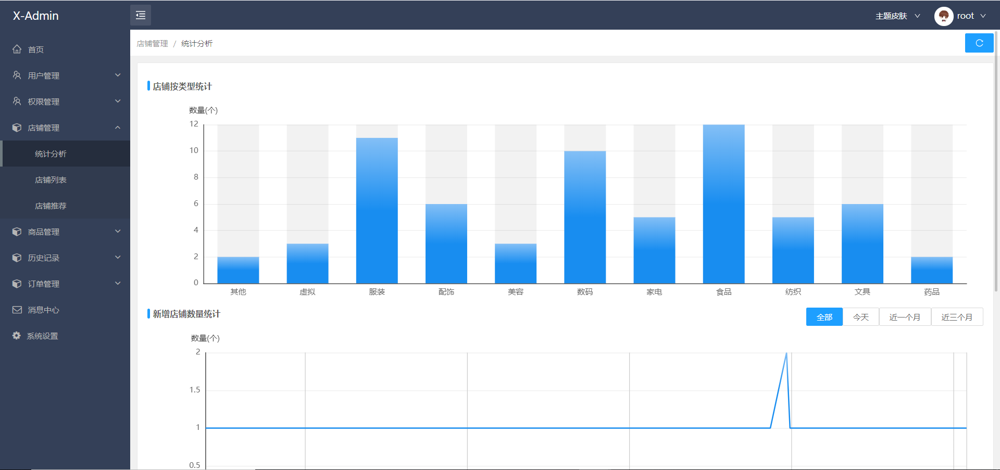

### 店铺管理--店铺列表

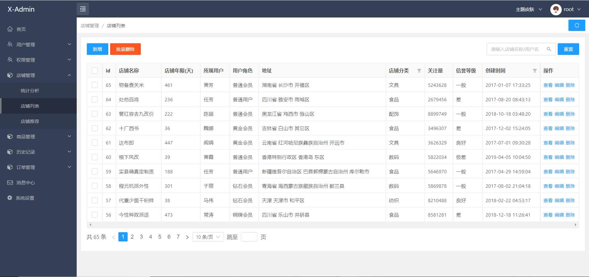

### 商品管理--商品列表

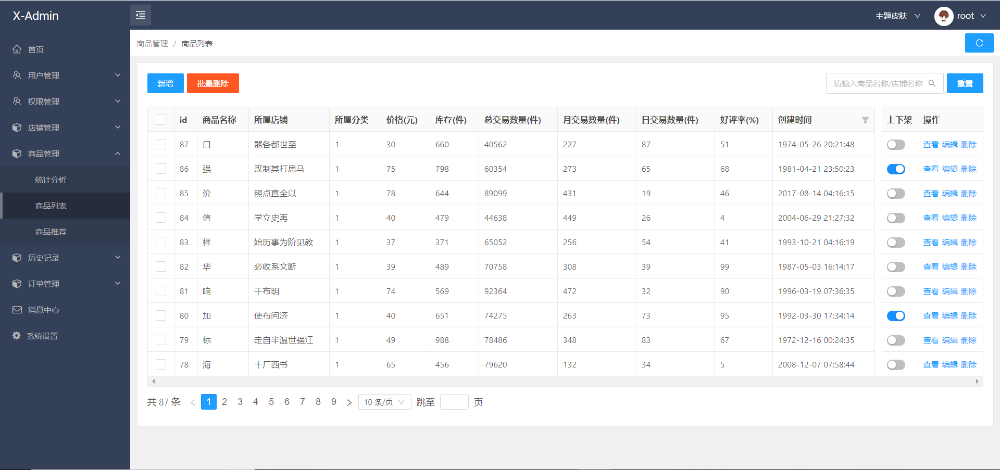

### 历史记录--删除用户历史

在此可以恢复已删除的用户或者永久删除该用户

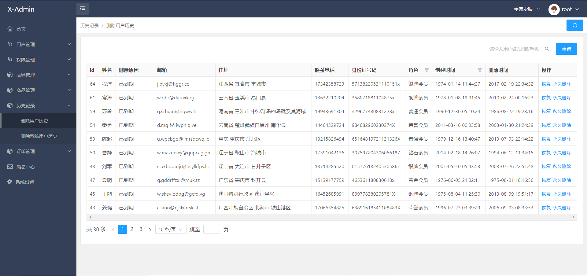

### 默认的主题皮肤

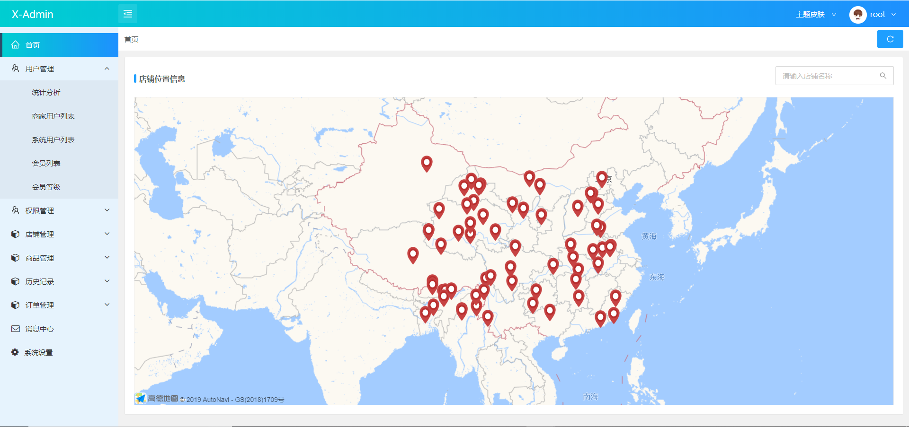

### 订单管理、消息中心、系统设置暂时还没有完成


## 项目目录简介

主要目录介绍：

    config                  ----webpack配置目录
    public
    scripts                 ----命令
    src                     ----源码目录
        ----assets          ----静态文件目录
            ----css         ----全局css目录
            ----images      ----图片
        ----auth            ----权限配置目录（暂时没做权限配置）
        ----components      ----公用组件
        ----config          ----公用配置（不是webpack的配置，而是项目的全局配置）
        ----mock            ----mock数据
        ----redux           ----redux目录
        ----routers         ----路由目录
        ----servers         ----接口请求
        ----utils           ----工具方法
        ----views           ----各模块代码主目录
        ----index.js        ----项目入口文件
        

###   src--config目录说明

name:配置项目名称

leftNavdefaultOpenAll: 是否默认展开所有侧导航一级菜单。  true展开  false不展开。如果配置为false,会展开当前路由所在的一级菜单，其他全部默认关闭。

CollapseModel：侧导航切换的模式。true为手风琴模式

collapsedDefaultOpen：默认是否展开侧导航。true展开  false收起

mock：是否使用mock数据。如果是生产环境此项配置不生效(暂无真实接口支持，只能用mock数据接口)

```javascript

module.exports = {
  name: 'X-Admin',
  leftNavdefaultOpenAll: false,
  CollapseModel: true,
  collapsedDefaultOpen: false,
  mock: true, 
};

```

###   src--assets--css--themeFn.scss文件说明

主题皮肤设置

## 写在最后，希望大家可以支持一下star,谢谢！！！
